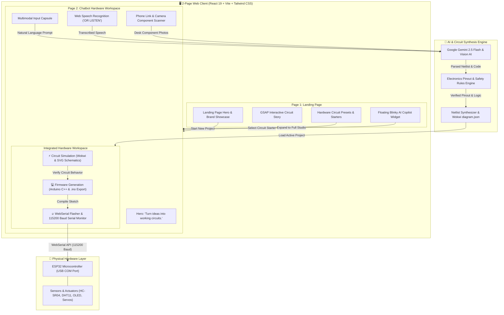

# ⚡ Blinky — AI Circuit & IoT Studio

> **Turn ideas into working circuits — powered by AI.**  
> Describe what you want to connect or capture components with your camera. Blinky synthesizes verified circuit schematics, writes production-ready Arduino/ESP32 firmware, and flashes hardware directly from your browser.

---

## 🏗️ System Architecture

Blinky is built around a streamlined **2-Page Architecture** that connects natural human intent (voice, text, and camera scan) to physical microcontrollers via AI circuit intelligence, interactive Wokwi simulation, and direct WebSerial firmware flashing.



---

## 🌟 The 2-Page Experience

### 1. 🌐 Landing Page (`LandingPage.jsx`)
- **Brand Hero & Interactive Showcase**: Explains the vision of bridging physical electronics with AI intelligence using GSAP scroll-triggered animations.
- **Direct Navigation to Chatbot**: Clicking **"Start New Project"**, any featured preset card, or the navigation buttons opens the Chatbot Page immediately without disruptive popup modals.
- **Live Circuit Story**: Interactive visual narrative illustrating how components (microcontroller, sensor, buzzer, LED) connect and respond.
- **Hardware Circuit Starters**: Curated templates including Water Level Alarms, HC-SR04 Ultrasonic Distance Meters, LED Blinkers, SSD1306 OLED Displays, and Dual-Axis Joysticks.
- **Floating AI Copilot Widget**: Persistent bottom-right circular robot widget offering fast circuit advice and one-click transition into the full-page Chatbot.

### 2. 💬 Chatbot Hardware Workspace (`CircuitChatPage.jsx`)
- **"Turn ideas into working circuits." Hero**:
  - Dark matrix background with colorful neon pixel stars (cyan, amber, pink, purple, emerald).
  - Floating 3D mascot (`blinky-mascot.png`) with ambient warm glow aura.
- **Multimodal Input Capsule**:
  - **Natural Language Text**: Type questions or component descriptions.
  - **Voice Speech Recognition (`OR LISTEN`)**: Speak your circuit requirements using browser-native Web Speech API.
  - **Camera Component Scanner**: Snap desk hardware components using your phone camera via Windows Phone Link or local LAN QR code.
- **Unified Hardware Workspace**:
  1. ⚡ **Circuit Simulation**: Live interactive Wokwi simulation canvas and schematic wiring diagram rendered directly in the conversation.
  2. 💻 **Code Generation**: Production-ready, non-blocking Arduino C++ code with syntax highlighting, copy-to-clipboard, and `.ino` download.
  3. 🔥 **WebSerial Flashing UI**: Direct browser-to-chip connection over USB serial, 1-click ESP32 flashing with progress animation, and real-time 115200 baud serial monitor.

---

## 📷 Multimodal Hardware Scanning (`ComponentCameraScanner.jsx`)

Blinky lets you scan physical components sitting on your desk without requiring third-party mobile apps:
- **Phone Link & Native Camera**: Snap photos on your phone and sync instantly via Windows Phone Link or native mobile file capture.
- **Clipboard Paste**: Press <kbd>Ctrl+V</kbd> anywhere inside the scanner modal to immediately paste copied hardware photos.
- **Local Wi-Fi LAN**: Open `http://<YOUR_LOCAL_IP>:5173` on your smartphone to snap photos directly into the desktop workspace.
- **Gemini Vision AI Engine**: Identifies microcontrollers (ESP32, Arduino Uno), sensors (ultrasonic, PIR, DHT11), and discrete components (resistors, LEDs, buttons) to automatically populate schematics.

---

## 🛠️ Technology Stack

| Domain | Technologies |
| :--- | :--- |
| **Architecture** | 2-Page Architecture (Landing Page + All-in-One Hardware Chatbot) |
| **Frontend Framework** | React 19, Vite, Tailwind CSS v4, Vanilla CSS Design System |
| **Diagramming & Design** | Mermaid.js, GSAP 3 (ScrollTrigger), Lucide React, Google Fonts (*Outfit 400-900*, *Inter*, *JetBrains Mono*) |
| **Circuit Simulation** | Wokwi Simulation Engine, SVG Vector Schematics, Netlist Layout Engine |
| **AI & Vision Synthesizer** | Google Gemini 2.5 Flash & Vision AI, Electronics Safety & Pinout Rules Engine |
| **Hardware & Flashing** | ESP32 DevKit V1, WebSerial API, `esptool.py`, PySerial (115200 Baud) |
| **Multimodal Capture** | Web Speech API, HTML5 Media Capture, Windows Phone Link, Wi-Fi LAN Hotspot |
| **Telemetry & Storage** | PostgreSQL, TigerData Real-time Stream |

---

## 📁 Project Structure

```text
blinkyAntigravity/
├── public/
│   ├── blinky-mascot.png            # 3D Blinky mascot asset
│   ├── chatbot-avatar.png           # Blinky circular robot avatar
│   ├── favicon.svg                  # Blinky brand icon
│   └── images/                      # High-resolution hardware & scan assets
├── src/
│   ├── Components/                  # Modular UI Components
│   │   ├── nodes/                   # SVG Schematic Component Nodes (ESP32, LED, Resistor, Buzzer, Ultrasonic)
│   │   ├── ui/                      # UI primitives
│   │   ├── CircuitChatPage.jsx      # Page 2: All-in-One AI Circuit Chatbot & Workspace
│   │   ├── circuitDiagram.jsx       # Tab 1: Wokwi Simulator & Blueprint Canvas
│   │   ├── CodePanel.jsx            # Tab 2: Arduino C++ Firmware Viewer & Exporter
│   │   ├── HardwarePanel.jsx        # Tab 3: ESP32 WebSerial Flasher & Serial Monitor
│   │   ├── ComponentCameraScanner.jsx # Phone Link / Camera Hardware Component Scanner
│   │   ├── FloatingChatWidget.jsx   # Circular Floating Bot Side Button & Chat Drawer
│   │   ├── InteractiveCircuitStory.jsx # GSAP Scroll-driven storytelling narrative
│   │   ├── LandingPage.jsx          # Page 1: Public landing page & showcase
│   │   ├── PromptBar.jsx            # Dynamic input capsule
│   │   └── wires.jsx                # Curved collision-free schematic wires
│   ├── data/
│   │   └── mockCircuits.js          # Curated circuit presets (Water Level, HC-SR04, LED, OLED, Joystick)
│   ├── services/
│   │   ├── api.js                   # Backend API client with offline fallback
│   │   ├── chatAssistant.js         # Circuit intelligence knowledge base & synthesizer
│   │   ├── hardwareApi.js           # WebSerial status & firmware flashing channel
│   │   └── visionDetection.js       # AI component vision recognition engine
│   ├── utils/
│   │   ├── layoutEngine.js          # Coordinate calculation & pin layout engine
│   │   └── wokwiExporter.js         # Wokwi diagram.json exporter
│   ├── App.css                      # Design tokens, dot matrix grid & animations
│   ├── App.jsx                      # Master controller & 2-page router
│   ├── index.css                    # Tailwind CSS v4 directives & font imports
│   └── main.jsx                     # Application bootstrap
├── index.html                       # HTML5 root with Google Fonts (Outfit, Inter)
├── package.json                     # Dependencies, scripts & build configuration
├── vite.config.js                   # Vite bundling, server host & Tailwind CSS v4 setup
└── README.md                        # Project documentation with Mermaid architecture
```

---

## 🚀 Getting Started

### 1. Prerequisites
- **Node.js**: `v18.0.0` or higher
- **npm**: `v9.0.0` or higher

### 2. Installation
```bash
# Clone the repository
git clone https://github.com/Codewith-Yogita/Blinky-AI-Circuit-IOT-Studio.git
cd Blinky-AI-Circuit-IOT-Studio

# Install dependencies
npm install
```

### 3. Development Server
```bash
npm run dev
```
Open [http://localhost:5173/](http://localhost:5173/) in your browser.  
To access from a smartphone on the same local Wi-Fi, open `http://<YOUR_LOCAL_IP>:5173/`.

### 4. Production Build
```bash
# Verify linting
npm run lint

# Build production bundle
npm run build
```

---

## 🎨 Design Philosophy

- **2-Page Simplicity**: Complete circuit journey (prompting, simulation, coding, flashing) lives in a single unified conversation page without navigating between complex sub-studios.
- **Matrix & Warm Ambient Aura**: Dark `#080709` obsidian palette complemented by a retro dot matrix grid, neon pixel stars, and warm amber-orange gradients.
- **Multimodal by Design**: Type, speak, or snap your hardware components — Blinky adapts to whatever input method is fastest.
- **Browser-Native WebSerial**: Flash real microcontrollers directly over USB without installing desktop IDEs or device driver bloat.

---

## 📄 License
This project is open-source under the MIT License.
