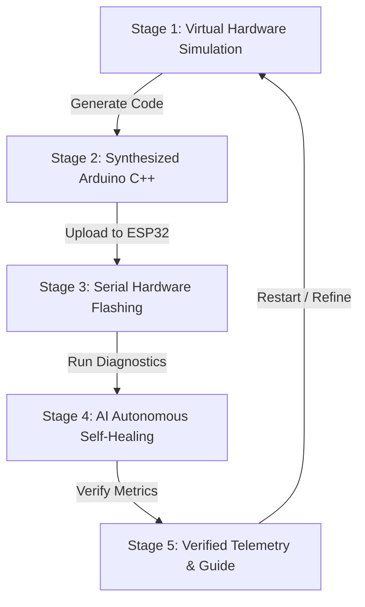

# ⚡ Blinky — AI-Powered Circuit & IoT Studio

> **Transform physical circuits into working IoT projects — powered by AI.**  
> Capture components with your phone camera, describe your project, and Blinky synthesizes verified circuit schematics with production-ready Arduino C++ firmware.

---

## 🌟 Overview & Key Experiences

Blinky is an end-to-end AI electronics assistant designed for hardware builders, students, and IoT engineers. The platform combines visual AI component detection, automated schematic synthesis, firmware compilation, browser-based hardware flashing, and an autonomous self-healing loop.

### 1. 🌐 Landing Page
- **Hero & 3D Interactive Headline**: Dynamic visual focal point featuring live component scanning illustrations and smooth navigation.
- **Editorial About Section**: Storytelling narrative illustrating the bridge from physical components to working IoT code.
- **How Blinky Works (4-Step Workflow)**:
  1. `Capture & Describe` (Camera input + voice/text prompt)
  2. `AI Understands` (Gemini Vision AI identifies ESP32, sensors, resistors)
  3. `Circuit & Code` (Interactive schematics + Arduino C++ generation)
  4. `Flash & Execute` (WebSerial chip flashing + real-time telemetry)
- **Hardware Circuit Library**: Pre-built, verified starters (HC-SR04 Ultrasonic Sensor, LED Blink, SSD1306 OLED Display, Analog Joystick).
- **Engineering Tech Stack Grid**: Categorized architecture overview covering frontend, backend, agentic AI, and database layers.
- **Monumental Bottom CTA**: High-impact *"Ready to dig in?"* launch portal.

### 2. ⚡ Launch Studio (5-Stage Autonomous Agentic Flow)
- **Edge-to-Edge Workspace**: Full-bleed layout with zero side gaps for maximum artboard focus.
- **Centered Monumental Headings**: Bold Outfit Black (900) typography centered with category badges.
- **Aesthetic Dark Capsule Buttons**: Custom pill buttons featuring outlined icon boxes (`[ Icon ]`), bold typography, and directional arrows (`→`).
- **AI Hardware Synthesizer Emphasis Box**: Dedicated glassmorphic prompt card with Gemini 2.5 Flash status indicator and quick idea chips.

---

## 🔁 5-Stage Agentic Workflow



1. **Stage 01 — Virtual Hardware Simulation**:
   - Interactive Wokwi canvas rendered directly from backend specifications.
   - Schematic blueprint, `diagram.json` editor, zoom controls, and live interactive runtime controls.
2. **Stage 02 — Synthesized Arduino C++**:
   - Production-ready, non-blocking firmware routines with syntax highlighting.
   - One-click copy, `.ino` sketch download, and Wokwi cloud export.
3. **Stage 03 — Serial Hardware Flashing**:
   - Direct browser-to-chip WebSerial upload via `esptool.py` and PySerial.
   - Real-time flashing progress bar and integrated 115200 baud serial monitor.
4. **Stage 04 — AI Autonomous Self-Healing**:
   - Agentic loop detecting timing thresholds and signal anomalies.
   - Autonomous code patch generation with visual diff and instant hot-flashing.
5. **Stage 05 — Verified Telemetry & Guide**:
   - Live sensor metrics synchronized with TigerData / PostgreSQL.
   - Step-by-step breadboard assembly guide and pin netlist wiring table.

---

## 📁 Project Structure

```text
blinkyAntigravity/
├── public/
│   ├── favicon.svg                  # Blinky branding icon
│   └── images/                      # High-resolution hardware & scan assets
│       ├── blinky_vision_scan.jpg   # Phone camera Gemini AI component scan
│       ├── hero_workbench.jpg       # ESP32 hardware workbench overview
│       ├── project_hcsr04.jpg       # HC-SR04 ultrasonic sensor project
│       ├── project_joystick.jpg     # Dual-axis thumbstick controller
│       ├── project_led.jpg          # Active breadboard LED circuit
│       └── project_oled.jpg         # I2C OLED display graphics module
├── src/
│   ├── Components/                  # Modular UI Components
│   │   ├── nodes/                   # SVG Schematic Component Nodes
│   │   │   ├── BuzzerNode.jsx
│   │   │   ├── ESP32Node.jsx
│   │   │   ├── GenericNode.jsx
│   │   │   ├── LEDNode.jsx
│   │   │   ├── ResistorNode.jsx
│   │   │   └── UltrasonicNode.jsx
│   │   ├── ui/                      # UI primitives (Tabs, etc.)
│   │   │   └── tabs.jsx
│   │   ├── AiSelfHealingCard.jsx    # Stage 4: AI Diagnostic & Self-Healing Loop
│   │   ├── circuitDiagram.jsx       # Stage 1: Wokwi Simulator & Blueprint Canvas
│   │   ├── CodePanel.jsx            # Stage 2: Arduino C++ Firmware Viewer & Exporter
│   │   ├── ComponentRenderer.jsx    # Dynamic SVG Node Dispatcher
│   │   ├── HardwarePanel.jsx        # Stage 3: ESP32 Flasher & Serial Monitor
│   │   ├── HardwareSimulator.jsx    # Interactive browser-side hardware simulator
│   │   ├── InstructionPanel.jsx     # Step-by-step assembly guide & pin netlist
│   │   ├── Interactive3DHeadline.jsx# Interactive 3D hero title
│   │   ├── LandingPage.jsx          # Public landing page & narrative showcase
│   │   ├── PromptBar.jsx            # AI Synthesizer box with quick starters
│   │   ├── SuccessBanner.jsx        # Stage 5: Verification celebration banner
│   │   ├── TelemetryPanel.jsx       # PostgreSQL / TigerData real-time sensor feed
│   │   ├── VisionVoiceBar.jsx       # Gemini Vision AI & audio guidance bar
│   │   ├── wires.jsx                # Curved collision-free schematic wires
│   │   └── WokwiCircuitCanvas.jsx   # Virtual breadboard artboard & zoom viewport
│   ├── data/
│   │   └── mockCircuits.js          # Curated circuit presets (HC-SR04, LED, OLED, Joystick)
│   ├── services/
│   │   ├── api.js                   # Backend API client with demo fallback mode
│   │   └── hardwareApi.js           # WebSerial status & firmware flashing channel
│   ├── utils/
│   │   ├── layoutEngine.js          # Coordinate calculation & pin layout engine
│   │   └── wokwiExporter.js         # Wokwi diagram.json exporter
│   ├── App.css                      # Design tokens, dark pill buttons & animations
│   ├── App.jsx                      # Master controller & 5-stage studio workspace
│   ├── index.css                    # Tailwind CSS v4 directives & font imports
│   └── main.jsx                     # Application bootstrap
├── index.html                       # HTML5 root with Google Fonts (Outfit 900, Inter)
├── package.json                     # Dependencies, scripts & build configuration
├── vite.config.js                   # Vite bundling & Tailwind CSS v4 setup
└── README.md                        # Documentation
```

---

## 🛠️ Technology Stack

| Domain | Technologies |
| :--- | :--- |
| **Frontend Framework** | React 19, Vite, Tailwind CSS v4, Vanilla CSS Design System |
| **Icons & Typography** | Lucide React, Google Fonts (*Outfit 400-900*, *Inter*, *JetBrains Mono*, *Caveat*) |
| **Circuit Simulation** | Wokwi Simulation Engine, SVG Vector Schematics, Canvas-Confetti |
| **AI & Agentic Loop** | Google Gemini 2.5 Flash / Vision AI, Python, FastAPI |
| **Hardware & Flashing** | ESP32 DevKit V1, WebSerial API, `esptool.py`, PySerial (115200 Baud) |
| **Telemetry & Storage** | PostgreSQL, TigerData Real-time Stream |

---

## 🚀 Getting Started

### 1. Prerequisites
- **Node.js**: v18.0.0 or higher
- **npm**: v9.0.0 or higher

### 2. Installation
```bash
# Clone the repository
git clone https://github.com/Codewith-Yogita/Blinky-AI-Circuit-IOT-Studio.git
cd Blinky-AI-Circuit-IOT-Studio

# Install dependencies
npm install
```

### 3. Environment Configuration (Optional)
Create a `.env` file in the root directory if connecting to a custom backend:
```env
VITE_API_BASE_URL=http://localhost:8000
VITE_USE_MOCK_API=false
```
*(If no backend is running, Blinky automatically falls back to built-in resilient mock synthesis).*

### 4. Development Server
```bash
npm run dev
```
Open [http://localhost:5173/](http://localhost:5173/) in your browser.

### 5. Production Build & Verification
```bash
# Verify linting
npm run lint

# Compile production bundle
npm run build
```

---

## 🎨 Design Philosophy

- **Amber-Red Obsidian Palette**: Deep `#080709` and `#131117` obsidian tones paired with refined amber-red borders (`border-amber-500/35`) and soft ambient glow, eliminating harsh neon glare.
- **Aesthetic Capsule Buttons**: Standardized across the application with an outlined icon container, bold typography, and micro-animated directional arrows.
- **Unboxed Typographic Authority**: Clean, monumental stage headings free from restrictive boxing, centered for maximum focus and symmetry.
- **Full-Bleed Studio Canvas**: Edge-to-edge workspace eliminating side margins so hardware schematics have maximum screen space.

---

## 📄 License
This project is open-source under the MIT License.
