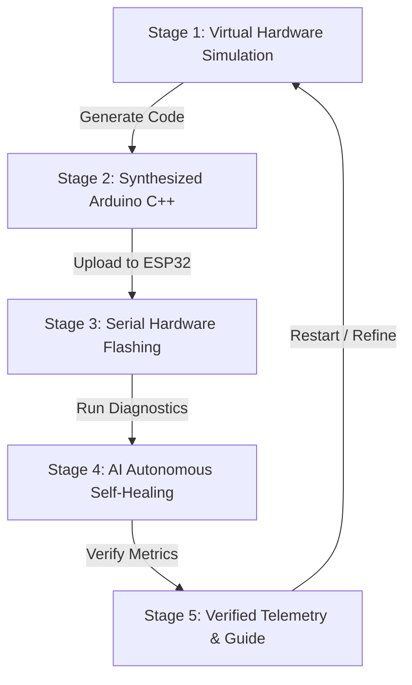

# ⚡ Blinky — AI-Powered Circuit & IoT Studio

> **Transform physical circuits into working IoT projects — powered by AI.**  
> Capture components with your phone camera, describe your project, and Blinky synthesizes verified circuit schematics with production-ready Arduino C++ firmware.

---

## 🌟 Overview & Key Experiences

Blinky is an end-to-end AI electronics assistant designed for hardware builders, students, and IoT engineers. The platform combines visual AI component detection, automated schematic synthesis, firmware compilation, browser-based hardware flashing, an autonomous self-healing loop, and an interactive AI copilot.

### 1. 🌐 Landing Page
- **Hero & 3D Interactive Headline**: Dynamic visual focal point featuring live component scanning illustrations, GSAP scroll-driven animations, and smooth navigation.
- **Circuit AI Chat Portal**: Dedicated nav links in both desktop header and mobile drawer leading directly to the conversational circuit synthesizer.
- **Editorial About Section**: Storytelling narrative illustrating the bridge from physical components to working IoT code.
- **How Blinky Works (4-Step Workflow)**:
  1. `Capture & Describe` (Phone Link camera capture + natural language prompts)
  2. `AI Understands` (Gemini Vision AI identifies ESP32, sensors, resistors)
  3. `Circuit & Code` (Interactive schematics + Arduino C++ generation)
  4. `Flash & Execute` (WebSerial chip flashing + real-time telemetry)
- **Hardware Circuit Library**: Pre-built, verified starters (Water Level Alarm, HC-SR04 Ultrasonic Sensor, LED Blink, SSD1306 OLED Display, Analog Joystick).
- **Engineering Tech Stack Grid**: Categorized architecture overview covering frontend, backend, agentic AI, and database layers.

### 2. 🤖 Floating Chatbot Side Button & Copilot Drawer
- **Persistent Bottom-Corner Widget**: Positioned at `bottom-6 right-6`, styled with an amber-orange gradient rim, clean white center, and the Blinky robot avatar with a speech bubble (`...`).
- **Live Status & Welcome Bubble**: Glowing green online beacon accompanied by an interactive welcoming tooltip for quick circuit queries.
- **Collapsible AI Copilot Drawer**:
  - Direct conversational assistance on ESP32 pin capabilities, pull-up resistors, voltage dividers, and I2C buses.
  - Quick query chips (*"💡 Water level alarm"*, *"📷 Scan my desk components"*, *"⚡ ESP32 GPIO pinout"*).
  - Synthesizes circuits on the fly and provides instant action cards: **"⚡ Open in Studio Simulator"** and **"🔥 Flash Directly to ESP32"**.
  - Integrated camera shortcut button and one-click expand to full-page chat.

### 3. 💬 Dedicated Full-Page Circuit AI Chat (`CircuitChatPage`)
- **ChatGPT-Style Circuit Studio**: Clean, distraction-free environment centered around an *"Investigate Your Circuit"* hero and multiline prompt bar.
- **Electronic Design Intelligence**: Built-in knowledge base verifying safe pin allocations (ADC1 vs ADC2 with Wi-Fi, strapping pins, capacitive touch, I2C/SPI buses).
- **Embedded Simulation Cards**: Generates complete Arduino C++ firmware and netlists, ready to simulate in Wokwi or flash to physical hardware.
- **Seamless State Hand-off**: Queries started in the floating side widget can be expanded directly into the full-page chat.

### 4. 📷 Phone Camera Hardware Scanner (`ComponentCameraScanner`)
- **No External Mobile Apps Needed**: Discards third-party mobile apps in favor of native browser standards, local Wi-Fi LAN access (`host: true`), and Windows Phone Link.
- **Multiple Capture Modes**:
  1. *Phone Link Direct Camera*: Uses `<input type="file" capture="environment">` to trigger your smartphone camera.
  2. *Clipboard Paste*: Press <kbd>Ctrl+V</kbd> anywhere in the modal to instantly paste photos copied from Windows Phone Link.
  3. *Local Wi-Fi QR Code*: Open the web app on your phone via LAN (`http://<local-ip>:5173`) to snap hardware directly.
  4. *Laptop Webcam Fallback*: Optional webcam tab (requires explicit activation, preventing accidental camera LED flashes).
- **Vision AI Component Detection**: Pinpoints microcontrollers, breadboards, ultrasonic sensors, potentiometers, and LEDs with bounding boxes and confidence scores.
- **Automated Synthesis**: Feeds detected components directly into Blinky AI to generate tailored circuits matching desk inventory.

### 5. ⚡ Launch Studio (5-Stage Autonomous Agentic Flow)
- **Edge-to-Edge Workspace**: Full-bleed layout with zero side gaps for maximum artboard focus.
- **Centered Monumental Headings**: Bold Outfit Black (900) typography centered with category badges.
- **Aesthetic Dark Capsule Buttons**: Custom pill buttons featuring outlined icon boxes (`[ Icon ]`), bold typography, and directional arrows (`→`).

---

## 🔁 5-Stage Agentic Workflow



1. **Stage 01 — Virtual Hardware Simulation**:
   - Interactive Wokwi canvas rendered directly from backend specifications.
   - Schematic blueprint, `diagram.json` editor, zoom controls, and live interactive runtime controls.
2. **Stage 02 — Synthesized Arduino C++**:
   - Production-ready, non-blocking firmware routines with syntax highlighting.
   - One-click copy, `.ino` sketch download, and Wokwi cloud export.
3. **Stage 03 — Serial Hardware Flashing**:
   - Direct browser-to-chip WebSerial upload via `esptool.py` and PySerial.
   - Real-time flashing progress bar and integrated 115200 baud serial monitor.
4. **Stage 04 — AI Autonomous Self-Healing**:
   - Agentic loop detecting timing thresholds and signal anomalies.
   - Autonomous code patch generation with visual diff and instant hot-flashing.
5. **Stage 05 — Verified Telemetry & Guide**:
   - Live sensor metrics synchronized with TigerData / PostgreSQL.
   - Step-by-step breadboard assembly guide and pin netlist wiring table.

---

## 📁 Project Structure

```text
blinkyAntigravity/
├── public/
│   ├── chatbot-avatar.png           # Blinky circular robot chatbot avatar
│   ├── favicon.svg                  # Blinky branding icon
│   └── images/                      # High-resolution hardware & scan assets
│       ├── blinky_vision_scan.jpg   # Phone camera Gemini AI component scan
│       ├── hero_workbench.jpg       # ESP32 hardware workbench overview
│       ├── project_hcsr04.jpg       # HC-SR04 ultrasonic sensor project
│       ├── project_joystick.jpg     # Dual-axis thumbstick controller
│       ├── project_led.jpg          # Active breadboard LED circuit
│       └── project_oled.jpg         # I2C OLED display graphics module
├── src/
│   ├── Components/                  # Modular UI Components
│   │   ├── nodes/                   # SVG Schematic Component Nodes
│   │   │   ├── BuzzerNode.jsx
│   │   │   ├── ESP32Node.jsx
│   │   │   ├── GenericNode.jsx
│   │   │   ├── LEDNode.jsx
│   │   │   ├── ResistorNode.jsx
│   │   │   └── UltrasonicNode.jsx
│   │   ├── ui/                      # UI primitives (Tabs, etc.)
│   │   │   └── tabs.jsx
│   │   ├── AiSelfHealingCard.jsx    # Stage 4: AI Diagnostic & Self-Healing Loop
│   │   ├── circuitDiagram.jsx       # Stage 1: Wokwi Simulator & Blueprint Canvas
│   │   ├── CircuitChatPage.jsx      # Dedicated Full-Page AI Circuit Chat Studio
│   │   ├── CodePanel.jsx            # Stage 2: Arduino C++ Firmware Viewer & Exporter
│   │   ├── ComponentCameraScanner.jsx # Phone Link / Camera Hardware Component Scanner
│   │   ├── ComponentRenderer.jsx    # Dynamic SVG Node Dispatcher
│   │   ├── FloatingChatWidget.jsx   # Circular Floating Bot Side Button & Chat Drawer
│   │   ├── HardwarePanel.jsx        # Stage 3: ESP32 Flasher & Serial Monitor
│   │   ├── HardwareSimulator.jsx    # Interactive browser-side hardware simulator
│   │   ├── InstructionPanel.jsx     # Step-by-step assembly guide & pin netlist
│   │   ├── InteractiveCircuitStory.jsx # GSAP Scroll-driven storytelling narrative
│   │   ├── LandingPage.jsx          # Public landing page & narrative showcase
│   │   ├── PromptBar.jsx            # Studio input bar
│   │   ├── SuccessBanner.jsx        # Stage 5: Verification celebration banner
│   │   ├── TelemetryPanel.jsx       # PostgreSQL / TigerData real-time sensor feed
│   │   ├── wires.jsx                # Curved collision-free schematic wires
│   │   └── WokwiCircuitCanvas.jsx   # Virtual breadboard artboard & zoom viewport
│   ├── data/
│   │   └── mockCircuits.js          # Curated circuit presets (Water Level, HC-SR04, LED, OLED, Joystick)
│   ├── services/
│   │   ├── api.js                   # Backend API client with demo fallback mode
│   │   ├── chatAssistant.js         # Circuit intelligence knowledge base & synthesizer
│   │   ├── hardwareApi.js           # WebSerial status & firmware flashing channel
│   │   └── visionDetection.js       # AI component vision recognition engine
│   ├── utils/
│   │   ├── layoutEngine.js          # Coordinate calculation & pin layout engine
│   │   └── wokwiExporter.js         # Wokwi diagram.json exporter
│   ├── App.css                      # Design tokens, dark pill buttons & animations
│   ├── App.jsx                      # Master controller, routing & 5-stage studio workspace
│   ├── index.css                    # Tailwind CSS v4 directives & font imports
│   └── main.jsx                     # Application bootstrap
├── index.html                       # HTML5 root with Google Fonts (Outfit 900, Inter)
├── package.json                     # Dependencies, scripts & build configuration
├── vite.config.js                   # Vite bundling, server host & Tailwind CSS v4 setup
└── README.md                        # Project documentation
```

---

## 🛠️ Technology Stack

| Domain | Technologies |
| :--- | :--- |
| **Frontend Framework** | React 19, Vite, Tailwind CSS v4, Vanilla CSS Design System |
| **Icons & Typography** | Lucide React, Google Fonts (*Outfit 400-900*, *Inter*, *JetBrains Mono*, *Caveat*) |
| **Animation Engine** | GSAP 3 (ScrollTrigger, Flip), CSS Keyframes |
| **Circuit Simulation** | Wokwi Simulation Engine, SVG Vector Schematics, Canvas-Confetti |
| **AI & Vision Synthesizer** | Google Gemini 2.5 Flash / Vision AI, Rule-Based Electronics Safety Engine |
| **Hardware & Flashing** | ESP32 DevKit V1, WebSerial API, `esptool.py`, PySerial (115200 Baud) |
| **Camera & Mobile Integration**| Native HTML5 Media Capture, Windows Phone Link, Wi-Fi LAN Hotspot |
| **Telemetry & Storage** | PostgreSQL, TigerData Real-time Stream |

---

## 🚀 Getting Started

### 1. Prerequisites
- **Node.js**: v18.0.0 or higher
- **npm**: v9.0.0 or higher

### 2. Installation
```bash
# Clone the repository
git clone https://github.com/Codewith-Yogita/Blinky-AI-Circuit-IOT-Studio.git
cd Blinky-AI-Circuit-IOT-Studio

# Install dependencies
npm install
```

### 3. Environment Configuration (Optional)
Create a `.env` file in the root directory if connecting to a custom backend:
```env
VITE_API_BASE_URL=http://localhost:8000
VITE_USE_MOCK_API=false
```
*(If no backend is running, Blinky automatically falls back to built-in resilient synthesis and simulation mode).*

### 4. Development Server
```bash
npm run dev
```
Open [http://localhost:5173/](http://localhost:5173/) in your browser.  
To access from a smartphone connected to the same Wi-Fi network, navigate to `http://<YOUR_LOCAL_IP>:5173/`.

### 5. Production Build & Verification
```bash
# Verify linting
npm run lint

# Compile production bundle
npm run build
```

---

## 🎨 Design Philosophy

- **Amber-Red Obsidian Palette**: Deep `#080709` and `#131117` obsidian tones paired with refined amber-red borders (`border-amber-500/35`) and soft ambient glow, eliminating harsh neon glare.
- **Aesthetic Capsule Buttons**: Standardized across the application with an outlined icon container, bold typography, and micro-animated directional arrows.
- **Unboxed Typographic Authority**: Clean, monumental stage headings free from restrictive boxing, centered for maximum focus and symmetry.
- **Full-Bleed Studio Canvas**: Edge-to-edge workspace eliminating side margins so hardware schematics have maximum screen space.
- **Responsive Viewport Scaling**: Pinned headers and action footers ensuring modals and workflows fit cleanly at 100% zoom across laptops and mobile devices.

---

## 📄 License
This project is open-source under the MIT License.
