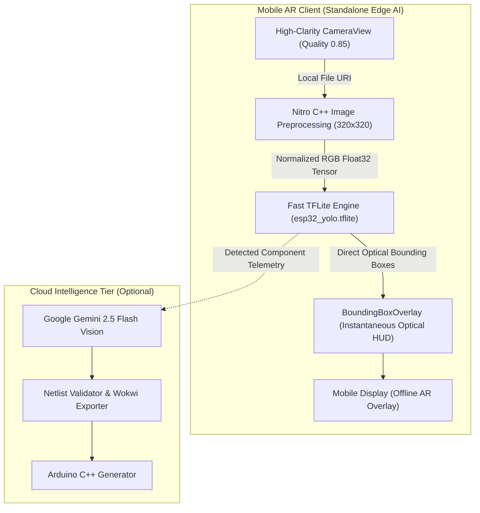

# AI & Vision Architecture Documentation

## Overview

Blinky AI IoT Studio utilizes a hybrid, multi-tier artificial intelligence pipeline designed for real-time edge perception, augmented reality (AR) overlay rendering, and natural language circuit schematic synthesis.

The system combines:
1. **Real-Time Edge Detector (YOLO)**: Sub-50ms component detection running on the server/edge to identify physical microcontrollers (ESP32), sensors, and discrete components (LEDs, resistors) in live camera video streams.
2. **Optical-Inertial 60 FPS Tracking**: Hardware IMU gyroscope sensor fusion on mobile devices that projects 3D orientation deltas onto 2D AR screen coordinates on the GPU thread.
3. **Multimodal Reasoning Engine (Google Gemini 2.5 Flash)**: Context-aware schematic synthesis, pinout safety verification, and automated Arduino/ESP32 C++ firmware compilation.
4. **Active Learning & Dataset Collection Pipeline**: Continuous live-frame collection directly from mobile hardware feeds to expand real-world model training datasets.

---

## Architectural Flow



---

## 1. Vision Engine & Local Inference

The local vision engine is implemented in `backend/vision_engine.py` and wrapped by a high-throughput FastAPI server in `backend/main.py`.

### Model Specifications
- **Architecture**: Ultralytics YOLO (Nano/Small profile for real-time edge processing)
- **Input Resolution**: `640x640` with dynamic letterbox padding
- **Inference Latency**: `25ms - 55ms` on modern desktop GPUs / modern multi-core CPUs
- **Quantization Support**: PyTorch FP32/FP16, ONNX, and TensorFlow Lite (`.tflite`)

### Coordinate Normalization
Detections return normalized bounding box coordinates relative to the input image dimensions:

$$\text{bbox} = \{x, y, w, h\} \quad \text{where } x, y, w, h \in [0.0, 1.0]$$

- $x$: Normalized horizontal coordinate of the top-left corner.
- $y$: Normalized vertical coordinate of the top-left corner.
- $w$: Normalized width of the component.
- $h$: Normalized height of the component.

---

## 2. 100% Offline On-Device Edge Neural Tracking

To achieve true untethered mobility in the lab or field without requiring a PC, backend server, or Wi-Fi network, Blinky runs YOLO neural inferences directly on the mobile device's neural engine.

### How It Works:
1. **Zero-Backend Standalone Inference**: The mobile client bundles `esp32_yolo.tflite` into native Android assets, executed directly by `react-native-fast-tflite` (native C++ TFLite engine).
2. **Accelerated Native Preprocessing**: Images captured from `expo-camera` are decoded and resized to $320 \times 320$ using `react-native-nitro-image` C++ native memory buffers, avoiding expensive JavaScript-to-native serialization.
3. **Pure Optical HUD (Zero Gyro Drift)**: Bounding boxes are rendered directly from instantaneous neural output onto the camera overlay. By relying purely on optical neural tracking, Blinky eliminates the sensor drift, calibration errors, and accelerometer noise inherent to hardware IMUs/gyroscopes.
4. **Vectorized Non-Maximum Suppression (NMS)**: Fast multi-class IoU filtering consolidates candidate detections into tight, crisp bounding boxes with confidence scores.

---

## 3. High-Clarity Camera Pipeline

Previous iterations used 640×480 previews with 0.15 JPEG quality, which introduced heavy block compression artifacts that reduced detection accuracy for small components like LEDs.

The current pipeline implements:
- **Resolution**: 1080p Full HD (`1920x1080` / `1080x1440` portrait).
- **Quality**: `0.85` JPEG quality (file size approx. 200–280 KB per frame).
- **Aspect Ratio Compensation**: Automatically accounts for differences between the camera sensor aspect ratio (4:3) and smartphone screen aspect ratios (19.5:9 / 20:9), centering the horizontal and vertical projection bounds.

---

## 4. Dual-Networking Architecture

To ensure consistent operation in both workshop tethered setups and portable demonstrations:
- **Primary Endpoint**: `http://localhost:8000` via ADB reverse port forwarding over USB (`adb reverse tcp:8000 tcp:8000`), yielding zero-latency transmission.
- **Secondary Endpoint**: Automatic fallback to local Wi-Fi LAN IP (`http://192.168.1.x:8000`), enabling completely wireless, untethered mobility.

---

## 5. Model Export & Edge Conversion

To enable offline inference directly on mobile hardware without a backend server, the model export pipeline converts trained PyTorch checkpoints into edge-compatible runtimes:

```
esp32_yolo.pt (PyTorch)
       │
       ▼ (Ultralytics ONNX Exporter)
esp32_yolo.onnx (ONNX FP32)
       │
       ▼ (backend/convert_onnx_to_tflite.py / onnx2tf)
mobile/assets/models/esp32_yolo.tflite (TensorFlow Lite)
       │
       ▼ (react-native-fast-tflite via NDK / GPU Delegate)
On-Device 60 FPS Inference
```
