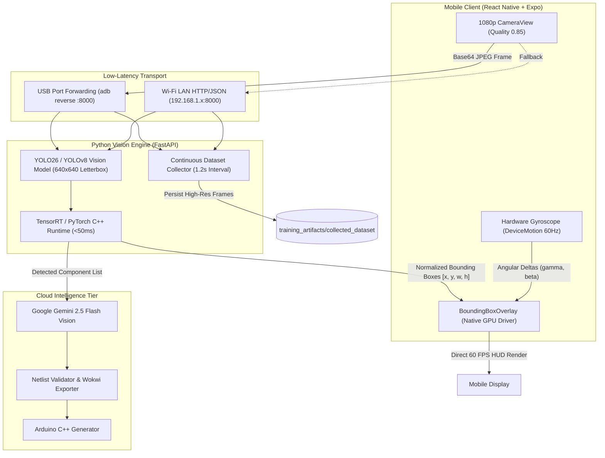

# AI & Vision Architecture Documentation

## Overview

Blinky AI IoT Studio utilizes a hybrid, multi-tier artificial intelligence pipeline designed for real-time edge perception, augmented reality (AR) overlay rendering, and natural language circuit schematic synthesis.

The system combines:
1. **Real-Time Edge Detector (YOLO)**: Sub-50ms component detection running on the server/edge to identify physical microcontrollers (ESP32), sensors, and discrete components (LEDs, resistors) in live camera video streams.
2. **Optical-Inertial 60 FPS Tracking**: Hardware IMU gyroscope sensor fusion on mobile devices that projects 3D orientation deltas onto 2D AR screen coordinates on the GPU thread.
3. **Multimodal Reasoning Engine (Google Gemini 2.5 Flash)**: Context-aware schematic synthesis, pinout safety verification, and automated Arduino/ESP32 C++ firmware compilation.
4. **Active Learning & Dataset Collection Pipeline**: Continuous live-frame collection directly from mobile hardware feeds to expand real-world model training datasets.

---

## Architectural Flow



---

## 1. Vision Engine & Local Inference

The local vision engine is implemented in `backend/vision_engine.py` and wrapped by a high-throughput FastAPI server in `backend/main.py`.

### Model Specifications
- **Architecture**: Ultralytics YOLO (Nano/Small profile for real-time edge processing)
- **Input Resolution**: `640x640` with dynamic letterbox padding
- **Inference Latency**: `25ms - 55ms` on modern desktop GPUs / modern multi-core CPUs
- **Quantization Support**: PyTorch FP32/FP16, ONNX, and TensorFlow Lite (`.tflite`)

### Coordinate Normalization
Detections return normalized bounding box coordinates relative to the input image dimensions:

$$\text{bbox} = \{x, y, w, h\} \quad \text{where } x, y, w, h \in [0.0, 1.0]$$

- $x$: Normalized horizontal coordinate of the top-left corner.
- $y$: Normalized vertical coordinate of the top-left corner.
- $w$: Normalized width of the component.
- $h$: Normalized height of the component.

---

## 2. Optical-Inertial 60 FPS AR Tracking

Standard video inference over Wi-Fi or USB introduces 30–80ms of network and inference latency. To achieve fluid 60 FPS motion without jitter or lagging bounding boxes, Blinky decouples **neural detection** from **screen rendering**.

### How It Works:
1. **Neural Anchor Calibration**: Whenever a fresh detection frame arrives from the vision model (approx. 5–15 FPS), the overlay locks the physical angular orientation from the gyroscope ($\beta_{\text{anchor}}, \gamma_{\text{anchor}}$).
2. **60 Hz Gyroscope Sampling**: Mobile hardware sensors (`DeviceMotion` from `expo-sensors`) sample the device's physical angular rotation every 16 milliseconds.
3. **Perspective Projection**:
   Angular shifts between the current device angle and the anchor are converted into pixel offsets:
   $$\Delta X = -\tan(\gamma - \gamma_{\text{anchor}}) \cdot (W_{\text{layout}} \cdot K_f)$$
   $$\Delta Y = \tan(\beta - \beta_{\text{anchor}}) \cdot (H_{\text{layout}} \cdot K_f)$$
   where $K_f \approx 1.35$ is the camera focal length scale multiplier.
4. **Native Driver GPU Acceleration**: The calculated offset $(\Delta X, \Delta Y)$ is dispatched directly to the native GPU compositor using `Animated.ValueXY` with `useNativeDriver: true`. This guarantees continuous 60 FPS rendering regardless of JS thread workload.

---

## 3. High-Clarity Camera Pipeline

Previous iterations used 640×480 previews with 0.15 JPEG quality, which introduced heavy block compression artifacts that reduced detection accuracy for small components like LEDs.

The current pipeline implements:
- **Resolution**: 1080p Full HD (`1920x1080` / `1080x1440` portrait).
- **Quality**: `0.85` JPEG quality (file size approx. 200–280 KB per frame).
- **Aspect Ratio Compensation**: Automatically accounts for differences between the camera sensor aspect ratio (4:3) and smartphone screen aspect ratios (19.5:9 / 20:9), centering the horizontal and vertical projection bounds.

---

## 4. Dual-Networking Architecture

To ensure consistent operation in both workshop tethered setups and portable demonstrations:
- **Primary Endpoint**: `http://localhost:8000` via ADB reverse port forwarding over USB (`adb reverse tcp:8000 tcp:8000`), yielding zero-latency transmission.
- **Secondary Endpoint**: Automatic fallback to local Wi-Fi LAN IP (`http://192.168.1.x:8000`), enabling completely wireless, untethered mobility.

---

## 5. Model Export & Edge Conversion

To enable offline inference directly on mobile hardware without a backend server, the model export pipeline converts trained PyTorch checkpoints into edge-compatible runtimes:

```
esp32_yolo.pt (PyTorch)
       │
       ▼ (Ultralytics ONNX Exporter)
esp32_yolo.onnx (ONNX FP32)
       │
       ▼ (backend/convert_onnx_to_tflite.py / onnx2tf)
mobile/assets/models/esp32_yolo.tflite (TensorFlow Lite)
       │
       ▼ (react-native-fast-tflite via NDK / GPU Delegate)
On-Device 60 FPS Inference
```
